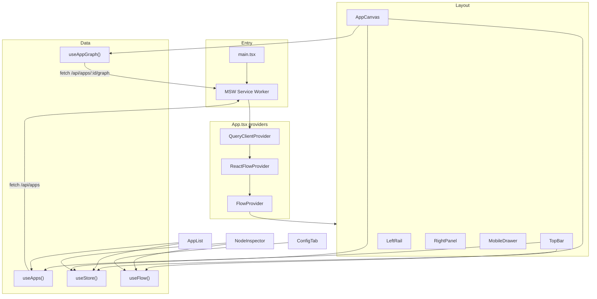

# App Graph Builder

A visual infrastructure dashboard for exploring service deployments across multiple applications. Select an app, view its dependency graph on an interactive canvas, inspect individual nodes, and edit their configuration in real time.

Built as a React SPA with ReactFlow for the graph canvas, TanStack Query for server state, Zustand for UI state, and MSW for API mocking (including production deployments).

---

## Table of Contents

- [Features](#features)
- [Tech Stack](#tech-stack)
- [Getting Started](#getting-started)
- [Project Structure](#project-structure)
- [Architecture](#architecture)
- [Data Flow](#data-flow)
- [State Management](#state-management)
- [API & Mocking (MSW)](#api--mocking-msw)
- [Component Guide](#component-guide)
- [Types Reference](#types-reference)
- [Styling & Theming](#styling--theming)
- [Keyboard Shortcuts](#keyboard-shortcuts)
- [Deployment](#deployment)
- [Scripts](#scripts)
- [Design Decisions](#design-decisions)
- [Known Limitations](#known-limitations)
- [Extending the Project](#extending-the-project)

---

## Features

- **Multi-app switcher** — Browse five SuperTokens SDK apps (Go, Java, Python, Ruby, Node)
- **Interactive graph canvas** — Pan, zoom, drag nodes, delete with keyboard, fit-to-view
- **Custom node types** — Service nodes and database nodes with distinct visuals
- **Node inspector** — Edit name, description, status, CPU limit, and node type
- **Runtime metrics** — Read-only CPU, memory, uptime, and provider info per node
- **Loading & error states** — Skeleton loaders, retry on failure, simulated network delays
- **Responsive layout** — Desktop three-column layout; mobile drawer for the side panel

---

## Tech Stack

| Layer | Library | Purpose |
|-------|---------|---------|
| Framework | React 18 + TypeScript | UI |
| Build | Vite 8 | Dev server & production bundle |
| Graph | `@xyflow/react` (ReactFlow) | Node/edge canvas |
| Server state | TanStack Query v5 | Fetching, caching, retries |
| UI state | Zustand v4 | Selection, panels, tabs |
| Mocking | MSW v2 | Intercepts `/api/*` requests |
| Styling | Tailwind CSS + CSS variables | Dark theme, layout grid |
| Components | shadcn/ui (Radix primitives) | Button, Tabs, Sheet, Slider, etc. |
| Icons | Lucide React | Icon set |

---

## Getting Started

### Prerequisites

- Node.js 18+
- npm

### Install & run

```bash
# Clone and enter the project
git clone <repo-url>
cd app-graph-builder

# Install dependencies
npm install

# Initialize MSW service worker (required once after clone)
npm run msw:init

# Start development server
npm run dev
```

Open `http://localhost:5173` in your browser.

### First-time MSW setup

MSW uses a service worker file at `public/mockServiceWorker.js`. If API calls fail locally with 404, run:

```bash
npm run msw:init
```

This copies the worker into `public/`. The file must be committed and is included in the production build.

---

## Project Structure

```
app-graph-builder/
├── public/
│   └── mockServiceWorker.js      # MSW service worker (generated by msw:init)
├── src/
│   ├── main.tsx                  # Entry point — starts MSW, then renders App
│   ├── App.tsx                   # Root layout, providers, keyboard shortcuts
│   ├── index.css                 # CSS variables, layout grid, canvas styles
│   │
│   ├── components/
│   │   ├── apps/
│   │   │   └── AppList.tsx       # Sidebar list of applications
│   │   ├── canvas/
│   │   │   ├── AppCanvas.tsx     # ReactFlow wrapper — loads graph, handles selection
│   │   │   ├── CanvasControls.tsx# Zoom/fit controls overlay
│   │   │   └── ServiceNode.tsx   # Custom node components (serviceNode, dbNode)
│   │   ├── inspector/
│   │   │   ├── NodeInspector.tsx # Inspector shell — name edit, tabs
│   │   │   ├── ConfigTab.tsx     # Editable node fields
│   │   │   └── RuntimeTab.tsx    # Read-only metrics display
│   │   ├── layout/
│   │   │   ├── TopBar.tsx        # App switcher dropdown, toolbar actions
│   │   │   ├── LeftRail.tsx      # Icon navigation rail (visual only)
│   │   │   ├── RightPanel.tsx    # App list + node inspector (desktop)
│   │   │   └── MobileDrawer.tsx  # Sheet wrapper for mobile side panel
│   │   └── ui/                   # shadcn/ui primitives (button, tabs, sheet, …)
│   │
│   ├── context/
│   │   └── FlowContext.tsx       # ReactFlow nodes/edges state + mutations
│   │
│   ├── hooks/
│   │   ├── useApps.ts            # TanStack Query — GET /api/apps
│   │   └── useAppGraph.ts        # TanStack Query — GET /api/apps/:id/graph
│   │
│   ├── mocks/
│   │   ├── browser.ts            # MSW worker setup
│   │   ├── handlers.ts           # Route handlers with delays & error simulation
│   │   └── data.ts               # Seed data — apps list + graph per app
│   │
│   ├── store/
│   │   └── useStore.ts           # Zustand — UI-only global state
│   │
│   ├── types/
│   │   └── index.ts              # App, ServiceNodeData, GraphData interfaces
│   │
│   └── lib/
│       └── utils.ts              # cn() — Tailwind class merge helper
│
├── index.html
├── vite.config.ts                # Vite + @ path alias
├── tsconfig.json
├── tailwind.config.js
└── package.json
```

---

## Architecture

The app follows a clear separation between **server state** (fetched data), **canvas state** (nodes/edges), and **UI state** (what is selected/open).



### Layout grid

Desktop uses a CSS Grid defined in `index.css`:

```
┌─────────────────────────────────────────────┐
│                   TopBar                     │
├──────┬──────────────────────────┬───────────┤
│ Left │                          │   Right   │
│ Rail │         Canvas           │   Panel   │
│ 52px │         (1fr)            │   300px   │
└──────┴──────────────────────────┴───────────┘
```

On mobile (`< 768px`), Left Rail and Right Panel are hidden. The side panel opens as a drawer via `MobileDrawer`.

---

## Data Flow

Understanding this flow is the key to reading the codebase.

### 1. App selection

```
User clicks app in AppList or TopBar dropdown
  → useStore.setSelectedApp(appId)
  → selectedNodeId resets to null
  → AppCanvas receives new appId prop
  → useAppGraph(appId) fetches graph (or serves from cache)
  → useEffect in AppCanvas calls setNodes/setEdges from FlowContext
  → ReactFlow re-renders with new graph
```

### 2. Node selection

```
User clicks a node on canvas
  → AppCanvas.onNodeClick → setSelectedNode(nodeId)
  → NodeInspector reads selectedNodeId from Zustand
  → NodeInspector finds matching node in FlowContext.nodes
  → ConfigTab / RuntimeTab render that node's data
```

### 3. Node editing

```
User edits a field in ConfigTab (e.g. status)
  → ConfigTab calls useFlow().updateNodeData(nodeId, { status: 'down' })
  → FlowContext immutably updates nodes array
  → ReactFlow re-renders the node card with new status badge
  → Changes exist only in memory — not persisted to API
```

### 4. Adding a node

```
User clicks Add (+) in TopBar or mobile FAB
  → App.tsx calls canvasRef.current.addNode()
  → AppCanvas → useFlow().addNode() creates node with defaults
  → New node is selected automatically
  → Inspector opens for the new node
```

---

## State Management

Three layers — each with a specific job. Do not mix responsibilities.

| Layer | Where | Holds | Persists? |
|-------|-------|-------|-----------|
| **Server state** | TanStack Query (`useApps`, `useAppGraph`) | Apps list, graph nodes/edges from API | Cached in memory (5 min apps, 30 sec graph) |
| **Canvas state** | `FlowContext` | Current nodes/edges, drag positions, edits | In memory only — resets on app switch or reload |
| **UI state** | Zustand (`useStore`) | Selected app/node, panel open, active tab | In memory only |

### Zustand store (`useStore.ts`)

| Field | Default | Purpose |
|-------|---------|---------|
| `selectedAppId` | `'app-1'` | Currently viewed application |
| `selectedNodeId` | `null` | Node open in inspector |
| `isMobilePanelOpen` | `false` | Mobile drawer visibility |
| `activeInspectorTab` | `'config'` | Config vs Runtime tab |
| `isAppListOpen` | `false` | TopBar dropdown state sync |

### FlowContext (`FlowContext.tsx`)

Wraps ReactFlow's `useNodesState` and `useEdgesState`. Exposes:

- `updateNodeData(id, partial)` — merge partial data into a node
- `updateNodeType(id, type)` — switch between `serviceNode` and `dbNode`
- `addNode()` — create a new service node at a random position

**Important:** When the user switches apps, `AppCanvas` replaces the entire nodes/edges array from fresh API data. Any local edits to the previous app's graph are lost.

---

## API & Mocking (MSW)

There is **no real backend**. All API responses are mocked by [MSW](https://mswjs.io/) (Mock Service Worker), which intercepts `fetch` calls at the network level.

### Endpoints

| Method | Path | Response | Notes |
|--------|------|----------|-------|
| `GET` | `/api/apps` | `{ data: App[] }` | 400ms simulated delay |
| `GET` | `/api/apps/:appId/graph` | `{ data: GraphData }` | 600ms delay; 10% random 500 error |

Handlers live in `src/mocks/handlers.ts`. Seed data lives in `src/mocks/data.ts`.

### How MSW starts

```tsx
// src/main.tsx
async function enableMocking() {
  const { worker } = await import('./mocks/browser')
  await worker.start({ onUnhandledRequest: 'bypass' })
}

enableMocking().then(() => {
  createRoot(...).render(<App />)
})
```

MSW runs in **both development and production**. The app waits for the service worker to register before rendering, so the first API call is always intercepted.

`onUnhandledRequest: 'bypass'` means requests MSW doesn't handle (fonts, assets) pass through normally.

### Why MSW instead of a real API?

- TanStack Query behaves identically to a production app — loading, error, retry, cache
- No backend to deploy or maintain for a demo/portfolio project
- Same mock data works locally and on Vercel without serverless functions

### Replacing mocks with a real API

When you connect a real backend:

1. Remove or gate MSW in `main.tsx` (e.g. only enable when `import.meta.env.VITE_USE_MOCKS === 'true'`)
2. Point hooks at your API base URL via an env variable:

```tsx
// src/hooks/useApps.ts
const API_BASE = import.meta.env.VITE_API_URL ?? ''
const res = await fetch(`${API_BASE}/api/apps`)
```

3. Keep the same response shape: `{ data: App[] }` and `{ data: GraphData }`

---

## Component Guide

### `App.tsx` — Application shell

- Creates the `QueryClient` with `refetchOnWindowFocus: false`
- Wraps everything in `QueryClientProvider`, `TooltipProvider`, `ReactFlowProvider`, `FlowProvider`
- Renders the grid layout: `TopBar`, `LeftRail`, `AppCanvas`, `RightPanel` / `MobileDrawer`
- Handles global keyboard shortcuts (`Escape`, `F`, `Cmd/Ctrl+Shift+F`)
- Detects mobile breakpoint (`< 768px`) for layout switching

### `AppCanvas.tsx` — Graph canvas

The most complex component. Responsibilities:

1. **Fetch** — `useAppGraph(appId)` loads graph data
2. **Sync** — `useEffect` pushes API data into FlowContext when it arrives
3. **Render** — `<ReactFlow>` with custom `nodeTypes` (`serviceNode`, `dbNode`)
4. **Interact** — node click → select, pane click → deselect, Delete → remove node
5. **Expose** — `forwardRef` + `useImperativeHandle` for `fitView()` and `addNode()` from parent
6. **States** — skeleton loading, error with retry button

ReactFlow instance is stored on `window.__reactFlow` for fit-view access from the imperative handle.

### `ServiceNode.tsx` — Custom nodes

Two exported components registered as ReactFlow node types:

- **`ServiceNode`** — App servers, message queues, etc.
- **`DbNode`** — Databases (Postgres, Redis, MongoDB, …)

Both render a card with status badge, icon, label, and connection handles. Selected state is driven by comparing `node.id` with `selectedNodeId` from Zustand.

### `NodeInspector.tsx` — Side panel detail view

- Shows empty state when no node is selected
- Inline name editing (click title → input → Enter/blur to save)
- Tabs: **Config** (editable) and **Runtime** (read-only metrics)

### `AppList.tsx` — Application picker

- Fetches apps via `useApps()`
- Highlights selected app with blue accent bar
- Shows spinner on selected app while its graph is fetching
- `Cmd/Ctrl+K` focuses the app list

### `LeftRail.tsx` — Navigation icons

Visual-only navigation rail. Icons (Graph, Databases, Services, etc.) are not wired to routing — only "Graph" appears active. Extend here when adding new views.

---

## Types Reference

Defined in `src/types/index.ts`:

```typescript
interface App {
  id: string        // e.g. 'app-1'
  name: string      // e.g. 'supertokens-golang'
  color: string     // Hex color for app icon background
  icon: string      // Key into APP_ICONS map ('go' | 'java' | 'python' | 'ruby' | 'node')
}

interface ServiceNodeData {
  label: string
  description: string
  status: 'healthy' | 'degraded' | 'down'
  cpuLimit: number              // 0–100
  activeTab: 'cpu' | 'memory' | 'disk' | 'region'
  provider: 'aws' | 'gcp' | 'azure'
  cost: string                  // Display string, e.g. '$0.03/HR'
  metrics: {
    cpu: number                 // 0–1 fraction
    memory: number              // GB
    disk: number
    region: string
  }
  nodeCategory?: 'service' | 'database'
}

interface GraphData {
  nodes: Node<ServiceNodeData>[]  // ReactFlow nodes
  edges: Edge[]                   // ReactFlow edges
}
```

---

## Styling & Theming

### CSS variables

All colors live in `:root` inside `src/index.css`. Components reference variables like `var(--accent-blue)` rather than hard-coded hex values.

Key tokens:

| Variable | Value | Usage |
|----------|-------|-------|
| `--bg-base` | `#080810` | Canvas background |
| `--bg-surface` | `#0f0f1a` | Panels, top bar |
| `--accent-blue` | `#4f6ef7` | Primary accent, selection |
| `--accent-green` | `#00e87a` | Healthy status |
| `--accent-red` | `#ff4d6a` | Error / down status |
| `--accent-yellow` | `#f5a623` | Degraded status |

### Tailwind

Utility classes handle spacing, flexbox, typography. The `cn()` helper in `src/lib/utils.ts` merges conditional classes (clsx + tailwind-merge).

### Path alias

`@/` maps to `src/` — configured in both `vite.config.ts` and `tsconfig.json`.

```typescript
import { useStore } from '@/store/useStore'
```

---

## Keyboard Shortcuts

| Key | Action |
|-----|--------|
| `Escape` | Deselect current node |
| `F` | Fit graph to viewport |
| `Cmd/Ctrl + Shift + F` | Fit graph to viewport |
| `Delete` / `Backspace` | Delete selected node(s) |
| `Cmd/Ctrl + K` | Focus app list |

---

## Deployment

### Vercel (recommended)

1. Push to GitHub and import the repo in Vercel
2. Framework preset: **Vite**
3. Build command: `npm run build`
4. Output directory: `dist`
5. No environment variables required — MSW handles all API calls in production

Ensure `public/mockServiceWorker.js` is committed. Vite copies it to `dist/` during build.

### How it works on Vercel

There are no serverless API routes. MSW's service worker intercepts `/api/*` requests in the browser after the static SPA loads. This is intentional for demo deployments.

### Production build locally

```bash
npm run build
npm run preview
```

---

## Scripts

| Command | Description |
|---------|-------------|
| `npm run dev` | Start Vite dev server with HMR |
| `npm run build` | Type-check (`tsc`) then production build |
| `npm run preview` | Serve the production build locally |
| `npm run lint` | Run ESLint |
| `npm run typecheck` | TypeScript check without emitting |
| `npm run msw:init` | Copy MSW service worker to `public/` |

---

## Design Decisions

**ReactFlow for the canvas** — First-class React integration, built-in drag/select/delete, TypeScript support, and custom node rendering without fighting the library.

**MSW for mocking** — Intercepts at the network layer so TanStack Query behaves exactly as it would against a real API, including loading states, error retries, and caching. Runs in production so Vercel deployments work without a backend.

**Zustand over Context for UI state** — `selectedNodeId` and panel visibility change frequently. Zustand's selector-based subscriptions avoid re-rendering unrelated components.

**FlowContext separate from Zustand** — Canvas nodes/edges use ReactFlow's built-in state hooks (`useNodesState`, `useEdgesState`). Keeping them in a dedicated context keeps ReactFlow lifecycle co-located.

**shadcn/ui** — Copy-paste components built on Radix primitives. Full control over styling without fighting default themes. All components live in `src/components/ui/`.

**CSS variables for theming** — Single source of truth for colors. Every component references the same tokens, making theme changes a one-file edit.

---

## Known Limitations

- **No persistence** — Node positions, edits, and newly added nodes exist only in memory. Reloading or switching apps resets the graph to seed data.
- **Simulated errors** — Graph endpoint returns 500 ~10% of the time (intentional, for error UI demo). Refresh to retry.
- **Left rail is decorative** — Navigation icons are not connected to routes or views.
- **No edge creation** — Users cannot draw new connections between nodes via drag.
- **Runtime metrics are static** — Values in RuntimeTab are hard-coded display strings, not live data.
- **Mobile tested at** 375px (iPhone SE) and 390px (iPhone 14).

---

## Extending the Project

### Add a new application

1. Add an entry to the `apps` array in `src/mocks/data.ts`
2. Create a graph object (`graphApp6`) with nodes and edges using `createNode()` / `createEdge()` helpers in the same file
3. Register it in the `graphData` map with a matching key (e.g. `'app-6'`)
4. Add an icon mapping in `AppList.tsx` → `APP_ICONS` if using a new icon key

### Add a new node type

1. Create a new component in `src/components/canvas/ServiceNode.tsx` (or a new file)
2. Register it in `AppCanvas.tsx` → `nodeTypes` object
3. Update `FlowContext.updateNodeType()` if the type should be switchable in ConfigTab
4. Use the new type string when creating nodes in `data.ts`

### Add a new API endpoint

1. Add a handler in `src/mocks/handlers.ts`
2. Create a TanStack Query hook in `src/hooks/`
3. Consume the hook in the relevant component

### Connect a real backend

See [Replacing mocks with a real API](#replacing-mocks-with-a-real-api) above. The hooks and response shapes are designed to swap cleanly — only `main.tsx` (disable MSW) and the fetch URLs need to change.

### Add routing (e.g. React Router)

Currently a single-page dashboard with no router. To add pages:

1. Install `react-router-dom`
2. Wire `LeftRail` icons to routes
3. Keep providers (`QueryClientProvider`, `FlowProvider`) above the router in `App.tsx`

---

## Live Demo

[Deploy link here]
